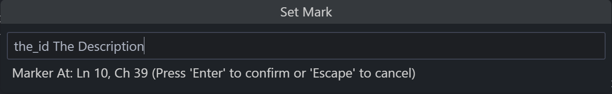

# marker-jumper

### A vscode extension to easily define and jump between points in your code

---

## Features

### Commands
|COMMAND NAME            |DESCRIPTION                                           |DEFAULT HOTKEY|COMMAND                         |
|------------------------|------------------------------------------------------|--------------|--------------------------------|
|**Set Mark**            |Sets a marker at the current cursor position          |`Ctrl+K N`    |`marker-jumper.setMark`         |
|**Go to Mark**          |Goes to a marker in the list                          |`Ctrl+K G`    |`marker-jumper.gotoMark`        |
|**Remove Mark**         |Removes a Markerfrom the list                         |---           |`marker-jumper.removeMark`      |
|**Clear Marks**         |Clears the entire list of bookmarks                   |---           |`marker-jumper.clearMarks`      |
|**Go To Last Used Mark**|Goes directly to the most recently used/created marker|`Ctrl+K L`    |`marker-jumper.gotoLastUsedMark`|

### Examples

To set a mark, you need to set a id and can set a description (that will appears on the list)

When you define a mark with an id that already exists, the old one will be replaced by the new one

Currently, the markers are not saved in persistent storage. This means that all saved bookmarks disappear when you close VSCode.
A setting to change this is planned for a near future.

<!--
## Extension Settings

Include if your extension adds any VS Code settings through the `contributes.configuration` extension point.

For example:

This extension contributes the following settings:

* `myExtension.enable`: Enable/disable this extension
* `myExtension.thing`: Set to `blah` to do something.
-->

## Known Issues

_No known issues_

## Release Notes

### 1.0.0

Initial release of Marker Jumper!